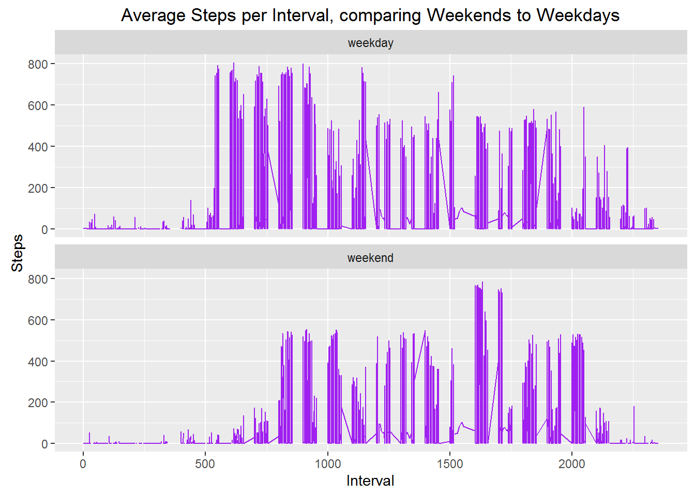

# Reproduceable Research Assignment
Damian Streets  
28 July 2016  


This assignment makes use of data from a personal activity monitoring device. This device collects data at 5 minute intervals through out the day. The data consists of two months of data from an anonymous individual collected during the months of October and November, 2012 and include the number of steps taken in 5 minute intervals each day.  

[Data was sourced from Course Website](https://d396qusza40orc.cloudfront.net/repdata%2Fdata%2Factivity.zip)  

##Loading and preprocessing the data  

* Load Data from Working directory, and reformat the dates to YMD format.  


```r
RawData <- read.csv("activity.csv")
RawData$date <- as.Date(RawData$date, "%Y-%m-%d")
head(RawData)
```

```
##   steps       date interval
## 1    NA 2012-10-01        0
## 2    NA 2012-10-01        5
## 3    NA 2012-10-01       10
## 4    NA 2012-10-01       15
## 5    NA 2012-10-01       20
## 6    NA 2012-10-01       25
```

##What is mean total number of steps taken per day?

Ignoring missing (NA) data   
* Calculate the total number of steps taken per day  
* Make a histogram of the total number of steps taken each day  
* Calculate and report the mean and median of the total number of steps taken per day  


```r
TotalStepsPerDay <- aggregate(steps ~ date, data = RawData, sum, na.rm = TRUE)
head(TotalStepsPerDay)
```

```
##         date steps
## 1 2012-10-02   126
## 2 2012-10-03 11352
## 3 2012-10-04 12116
## 4 2012-10-05 13294
## 5 2012-10-06 15420
## 6 2012-10-07 11015
```


```r
hist(TotalStepsPerDay$steps, xlab="Steps", ylab="Number of Days", main="Frequency of each Daily Step Total", col="purple")
```

<!-- -->


```r
a_val <- round(mean(TotalStepsPerDay$steps, na.rm = TRUE),2)
b_val <- round(median(TotalStepsPerDay$steps, na.rm = TRUE),2)
```

The **mean** number of Steps per Day (ignoring missing values) was 10766.19  
The **median** number of Steps per Day (ignoring missing values) was 10765  

##What is the average daily activity pattern?  

* Make a time series plot (i.e. type = "l") of the 5-minute interval (x-axis) and the average number of steps taken, averaged across all days (y-axis)


```r
AverageStepsPerInterval <- aggregate(steps ~ interval,data = RawData, mean, na.rm = TRUE)

g <- ggplot(AverageStepsPerInterval, mapping=aes(interval, steps)) + geom_line(colour="purple", size=1)
g + ggtitle("Average steps per 5 minute interval in a day")
```

<!-- -->

* Which 5-minute interval, on average across all the days in the dataset, contains the maximum number of steps?


```r
max_row_id <- which.max(AverageStepsPerInterval$steps)

intv <- AverageStepsPerInterval[max_row_id, "interval"]
```

The **5 minute interval** with the maximum average Steps per Day (ignoring missing values) was 835    

##Imputing missing values

Note that there are a number of days/intervals where there are missing values (coded as NA). The presence of missing days may introduce bias into some calculations or summaries of the data.  

* Calculate and report the total number of missing values in the dataset (i.e. the total number of rows with NAs)  


```r
num_na <- sum(!complete.cases(RawData))
```

There are 2304 rows of incomplete data  

* Devise a strategy for filling in all of the missing values in the dataset  
* Create a new dataset that is equal to the original dataset but with the missing data filled in.  


```r
# Using Merge to assign the average for an Interval to any null rows. 

# A set of non-complete cases
na <- !complete.cases(RawData)

#merge on Interval
CleanData <- merge(RawData, AverageStepsPerInterval, by="interval")

# Write the Value for the Average for an Interval to any null row in the Original Data set.
CleanData$steps.x[na] <- CleanData$steps.y[na]

#Only want the first 3 rows
CleanData <- CleanData[, c(1:3)]

#rename the columns to remove the steps.x reference.
names(CleanData) <- c("Interval", "Steps", "Date")
```

* Make a histogram of the total number of steps taken each day


```r
TotalStepsPerCleanDay <- aggregate(Steps ~ Date, data = CleanData, sum, na.rm = TRUE)
hist(TotalStepsPerCleanDay$Steps, xlab="Steps", ylab="Number of Days", main="Freq of  Daily Step Total (nulls assigned average for the Interval)", col="purple")
```

<!-- -->


```r
c_val <- mean(TotalStepsPerCleanDay$Steps, na.rm = TRUE)
d_val <-  median(TotalStepsPerCleanDay$Steps, na.rm = TRUE)
```

The **mean** number of Steps per Day (**inferring missing values**) was 9563.93   
The **median** number of Steps per Day (**inferring missing values**) was 11215.68    

* Do these values differ from the estimates from the first part of the assignment?  
* What is the impact of imputing missing data on the estimates of the total daily number of steps?  

The Original **mean** was 10766.19 and is now 9563.93 a differnce of **1202.26 **  
The Original **median** was 10765 and is now 11215.68 a differnce of **-450.68 **

The difference after inferring values for mean is large; but for median much smaller.  

##Are there differences in activity patterns between weekdays and weekends?

* Create a new factor variable in the dataset with two levels - "weekday" and "weekend" indicating whether a given date is a weekday or weekend day.  


```r
CleanData$Weekday <- weekdays(CleanData$Date) 
CleanData$WeekPart <- ifelse(CleanData$Weekday == 'Saturday' | CleanData$Weekday == 'Sunday', 'weekend', 'weekday')
```

* Make a panel plot containing a time series plot (i.e. type = "l") of the 5-minute interval (x-axis) and the average number of steps taken, averaged across all weekday days or weekend days (y-axis).


```r
g <- ggplot(CleanData, mapping=aes(x=Interval, y=Steps, color=WeekPart)) + geom_line(colour="purple") + facet_wrap(~WeekPart, ncol=1, nrow=2)
g + ggtitle("Average Steps per Interval, comparing Weekends to Weekdays")
```

<!-- -->


